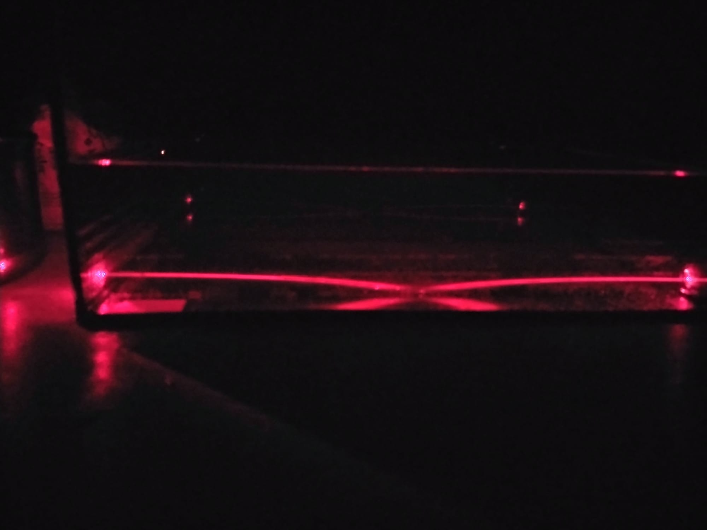
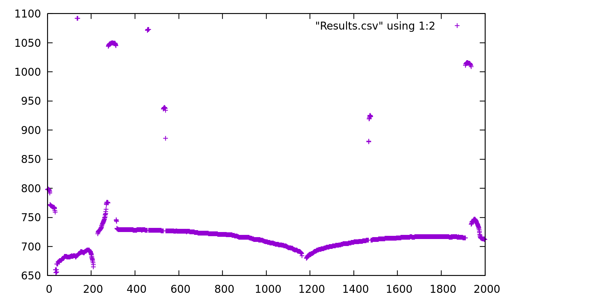

# Laser_image_processor
A program to process an image and output coordinates of it's path

This is written for a university project.
This program takes an input image of a red laser (It will not work if it is not red) and outputs the coordinates of the pixels of the lasers path.

Input image:

Output image:

The results are written to Results.csv.
The graph was plotted with gnuplot.

## Install
# Windows
Download the windows binary, image_processor.exe from the repository and add to path using: https://www.architectryan.com/2018/03/17/add-to-the-path-on-windows-10/

# Linux
Install the rust toolchain at https://www.rust-lang.org/tools/install
Clone the directory using git then run cargo build ` --release `
Then add /target/release to path in your ~/.profile 

## How to use

run the following command in a terminal: `image_processor --image-file-name <IMAGE_FILE_NAME> --r-value <R_VALUE> --output-file-name <OUTPUT_FILE_NAME>`

The results will be written to OUTPUT_FILE_NAME where the first column is the x corrdinates and the y column lists the y coordinates.
